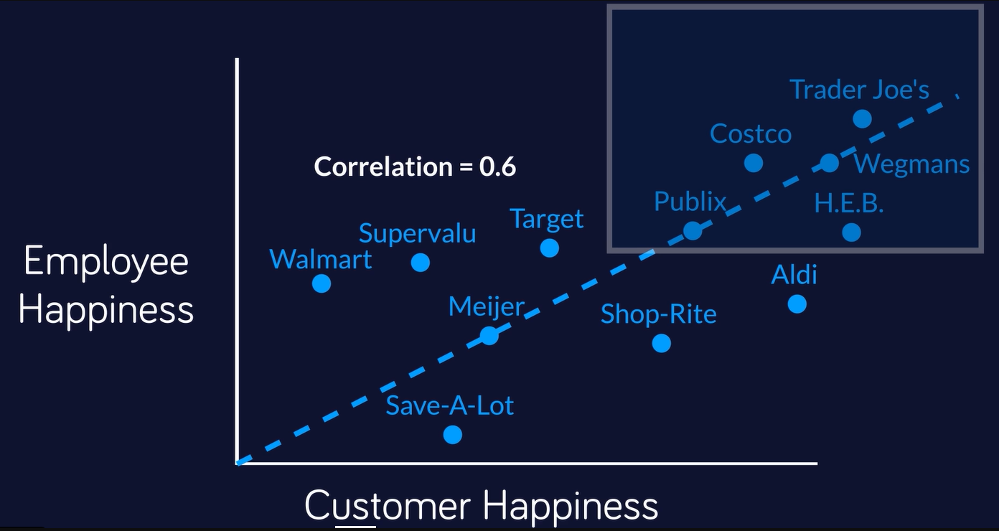

<style type="text/css">
.title {
  display: none;
}

#getting-started img {
  margin-right: 10px;
}

</style>

<div class="row" style="padding-top: 30px;">
<div class="col-sm-6">

```{r setup, include=FALSE}
knitr::opts_chunk$set(echo = TRUE)
```


## Tell your data story

Most white papers go unread. My friend Joe Kolman and I sought to show how the data underlying a white paper can be animated to create a short, upbeat video that rises above the fray.

To get the data, I wrote a 
[Python program](https://github.com/DDArmstrong/Customer_Employee_Happiness) to scrape Glassdoor’s employee experience ratings for thousands of companies and Reuters for the names, titles and ages of every director of every company in the Russell 3,000.

The video is the tip of the iceberg in terms of visuals and stories that came out of this project. (For instance, see this [Salesforce](https://www.salesforce.com/blog/employee-experience-and-customer-experience-for-revenue-growth-2/) report.)


</div>
<div class="col-sm-6">


<a href = "https://vimeo.com/693768664/3a622a67f4">


</a>
</div>
