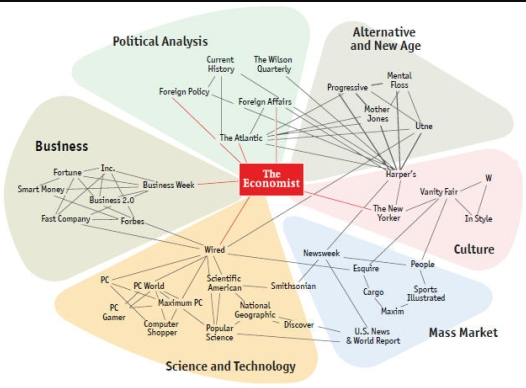

<style type="text/css">
.title {
  display: none;
}

#getting-started img {
  margin-right: 10px;
}

</style>

<div class="row" style="padding-top: 30px;">
<div class="col-sm-6">

```{r setup, include=FALSE}
knitr::opts_chunk$set(echo = TRUE)
```

## The Economist as the center of the magazine world


Created for the board of directors of <u>The Economist</u>, this visual shows the “people who read this also read that” links from Amazon.com’s recommendation engine. The punch line: Regardless of whether you’re a sports freak, a computer nerd or a policy wonk, <u>The Economist</u> is your general news source of choice.

For this visual, I wrote a program in Perl (this was before the days of Python and BeautifulSoup) to crawl through Amazon’s book and magazine recommendations and generate a graph database. How is <u>Soldier of Fortune</u> connected to <u>Martha Stewart’s Living</u>? It’s not six degrees of separation. Try two.

The project yielded lots of insights about clusters of common interests among readers. We all live in our own bubbles.


</div>
<div class="col-sm-6">



</div>
